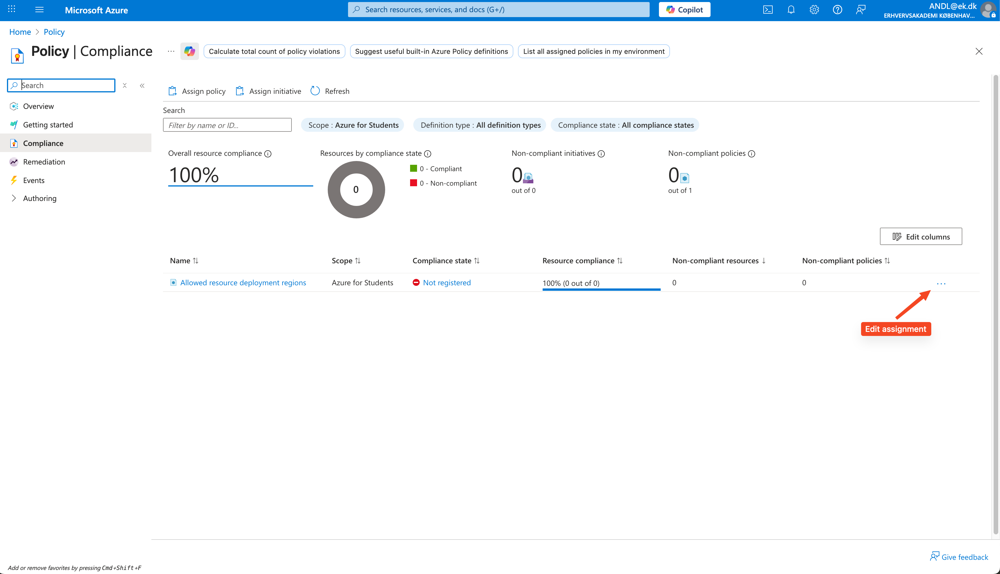
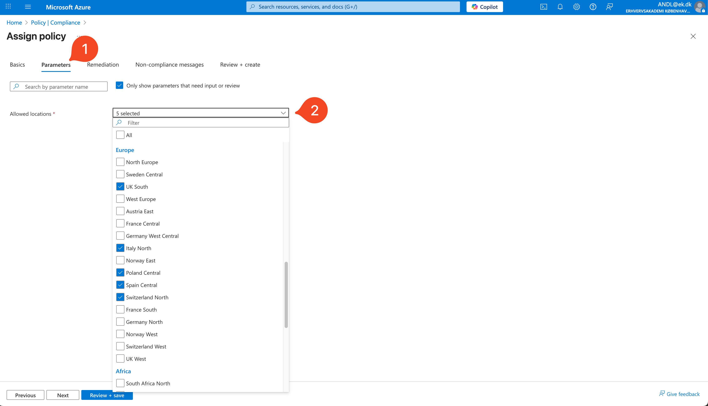

# Azure Available Regions

Figure out which regions you are allowed to deploy to.

**Motivation**: It seems like that available regions is severely limited on the `ek` domain (Azure For Students) and differ between accounts with no rhyme or reason. It is not possible to change the available regions.

**Deadline**: Before class

---

## The Azure Portal Method

1. Go to [this link](https://portal.azure.com/#view/Microsoft_Azure_Policy/PolicyMenuBlade/~/Compliance) after being logged in to your Azure For Students account with your `ek` mail.

2. You will see a row representing policies for your Azure for Students account. Click on the three dots on the right and select **Edit Assignment**:



3. Choose the **Parameters** tab and expand the dropdown. You will see the available regions.



**Note**: Your available regions will likely differ from the screenshot above.

---

## Scripting Method

### Prerequisites

If you are on **Windows** then run the following scripts on `Windows Subsystem for Linux`, `Git Bash` or the equivalent.

1. Install `AZ CLI`:

https://learn.microsoft.com/en-us/cli/azure/install-azure-cli-windows?view=azure-cli-latest&pivots=winget

2. Log in with your browser to get the subscription id. In your terminal run:

```bash
$ az login
```

### The Script

This script tests what regions you are allowed to create VMs in. While you are allowed to create resource groups in **ALL** regions this does not translate to permission to actually create VMs in said region.

If you are on *nix you will have to make the script executable:

```bash
$ chmod +x <script_name>
```

And run it:

```bash
$ ./<script_name>
```

The script:

```bash
#!/bin/bash

echo "Testing regions with storage account creation..."
echo ""

# Create a test resource group first
az group create --name "policy-test-rg" --location "uksouth" --output none 2>/dev/null

for region in $(az account list-locations --query "[].name" --output tsv); do
    echo -n "$region... "
    
    storage_name="test$(date +%s)$RANDOM"
    
    if az storage account create \
        --name $storage_name \
        --resource-group "policy-test-rg" \
        --location $region \
        --sku Standard_LRS \
        --output none 2>/dev/null; then
        echo "✅ AVAILABLE"
        # Clean up
        az storage account delete --name $storage_name --resource-group "policy-test-rg" --yes --output none 2>/dev/null
    else
        echo "❌ BLOCKED"
    fi
done

# Clean up resource group
az group delete --name "policy-test-rg" --yes --no-wait --output none 2>/dev/null
```

---

## Deploy through scripts

## Prerequisites

If you are on **Windows** then run the following scripts on `Windows Subsystem for Linux`, `Git Bash` or the equivalent.

If you have problems deploying through the portal here is a method to deploy through scripts using `AZ CLI`.

1. Install `AZ CLI`:

https://learn.microsoft.com/en-us/cli/azure/install-azure-cli-windows?view=azure-cli-latest&pivots=winget

2. Log in with your browser to get the subscription id. In your terminal run:

```bash
$ az login
```

## Provision

1. Create a script. Let's call it `vm_create.sh`. 

If you are on *nix you will have to make the script executable:

```bash
$ chmod +x vm_create.sh
```

2. Paste the following into `vm_create.sh`:


```bash
# Variables
RG_NAME="vmtest"
LOCATION="spaincentral"
VM_NAME="vm1"
ADMIN_USER="adminuser"
SSH_KEY_PATH="~/.ssh/id_rsa.pub"
 
# 1. Create Resource Group
az group create --name $RG_NAME --location $LOCATION
 
# 2. Create VM
az vm create \
  --resource-group $RG_NAME \
  --name $VM_NAME \
  --image Ubuntu2204 \
  --size Standard_B1s \
  --admin-username $ADMIN_USER \
  --public-ip-sku Standard \
  --authentication-type ssh \
  --ssh-key-values $SSH_KEY_PATH \
  --output table
 
# 3. Open SSH port
az vm open-port --resource-group $RG_NAME --name $VM_NAME --port 22

# 4. Get and print VM IP address
echo "VM IP Address:"
az vm show --resource-group $RG_NAME --name $VM_NAME --show-details --query publicIps --output tsv
```

3. Change the variables section and use names that makes sense for your purpose. Remember to use the region that you have permission to use. Make sure that the `SSH_KEY_PATH` is valid on your computer.

4. Run the script:

```bash
$ ./vm_create.sh
```

You should now have a server provisioned with an IP address that you can SSH in to.

### Tear down the server

If you need to destroy the server and the resource here is a script. Make sure that the variables are the same as in the create script.

1. Create a file called `vm_destroy.sh`.

If you are on *nix you will have to make the script executable:

```bash
$ chmod +x vm_destroy.sh
```

2. In the file paste the following:

```bash
# Variables
RG_NAME="vmtest"
LOCATION="spaincentral"
VM_NAME="vm1"
ADMIN_USER="adminuser"
SSH_KEY_PATH="~/.ssh/id_rsa.pub"

# 1. Delete VM
az vm delete --resource-group $RG_NAME --name $VM_NAME --yes

# 2. Delete Resource Group
az group delete --name $RG_NAME --yes --no-wait
```

3. Run the script

```bash
$ ./vm_destroy.sh
```

Voilà! The server, resource group and everything else has been taken down.


