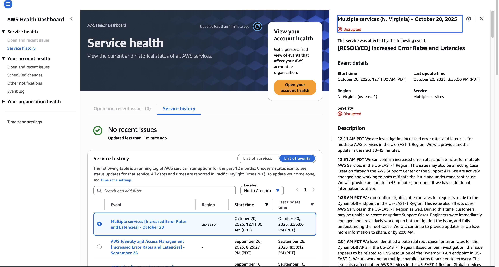

    <h1>Incident response and Postmortem</h1>

---

# AWS Incident October 20th 2025

https://health.aws.amazon.com/health/status?eventID=arn:aws:health:us-east-1::event/MULTIPLE_SERVICES/AWS_MULTIPLE_SERVICES_OPERATIONAL_ISSUE/AWS_MULTIPLE_SERVICES_OPERATIONAL_ISSUE_BA540_514A652BE1A

---

# Github Incident

---

# Github Incident

---

# Github Incident

---

# Github Incident

---

# Github Incident

---

# Cloudflare Incident

https://blog.cloudflare.com/cloudflare-incident-on-february-6-2025/

> We’re deeply sorry for this incident: this was a failure of a number of controls, and we are prioritizing work to implement additional system-level controls related not only to our abuse processing systems, but so that we continue to reduce the blast radius of any system- or human- action that could result in disabling any production service at Cloudflare.

Humans should be expected to fail. Systems should be designed to handle human errors, otherwise it's a failure of the system.

---

# Postmortem

A postmortem is a document that outlines the steps taken to resolve an incident.

Do you remember from the guest lecture what was important in a postmortem?

**Hint**: *It's an important part of the DevOps culture.*

---

# Blameless Postmortem

[Optional] Assignment: Create a blameless postmortem for a major incident you may run into. 

